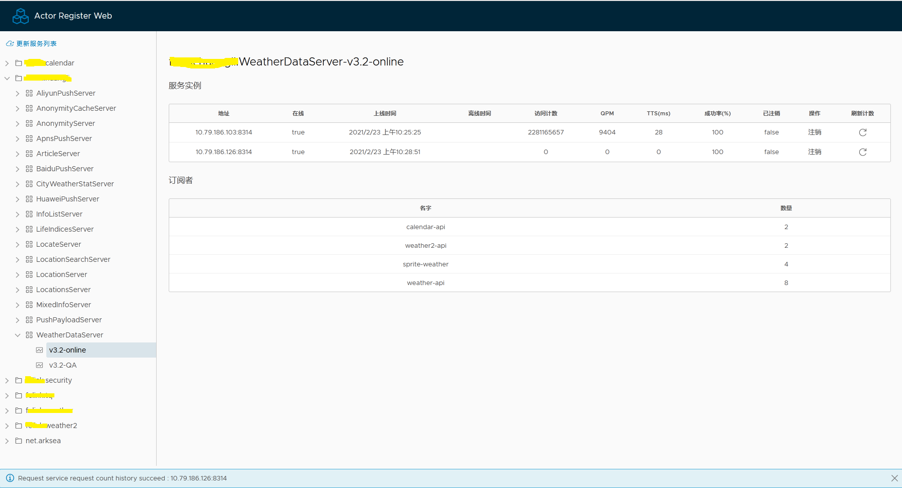
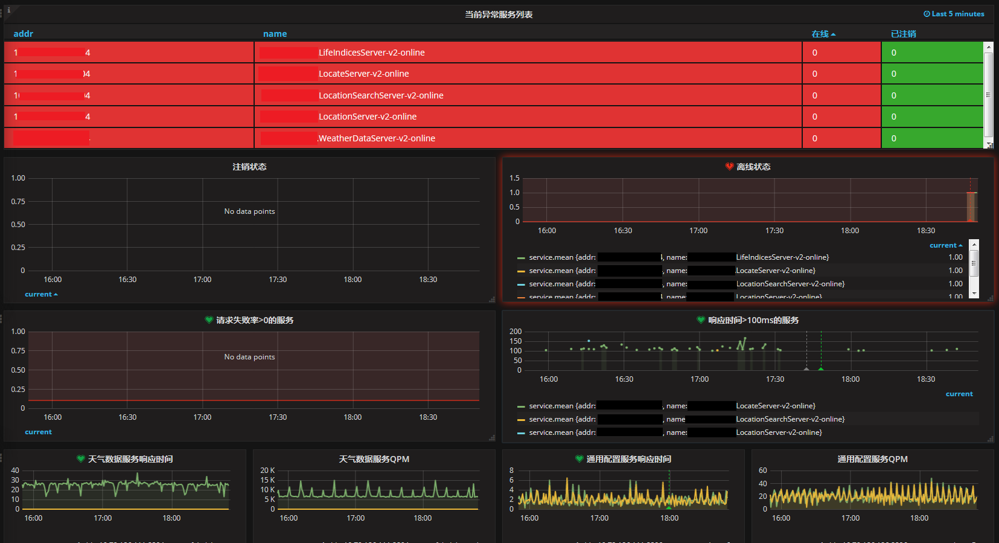
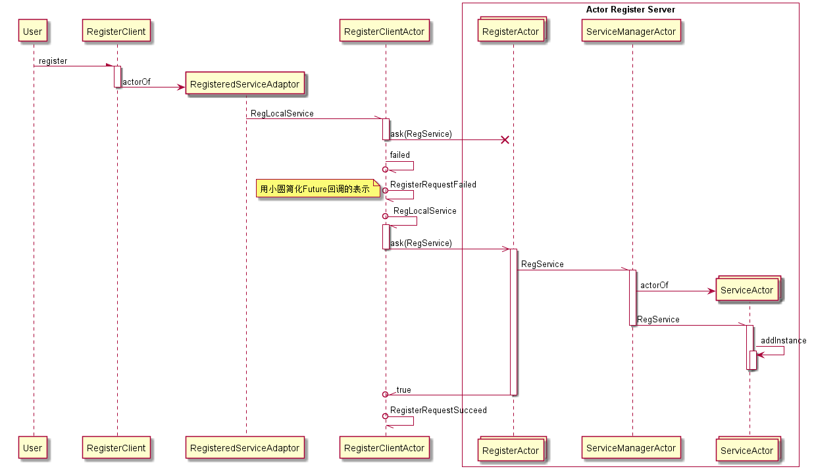
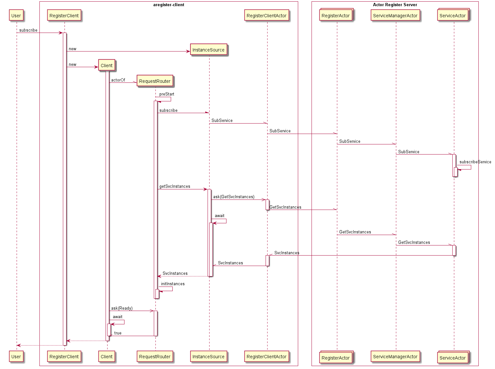

## 简介
基于Akka实现的注册服务，为基于Akka编写的服务提供自动发现能力，支持对集群中服务节点的均衡访问，提供管理页面查询服务状态

## 服务状态查询页面

 
 
## 服务状态上报InfluxDB



在application.conf中配置InfluxDB即可开启
```groovy
register {
    store {
        type = "redis"
        redis-host = "127.0.0.1"
        redis-port = 6379
        redis-password = "123456"
    }
    stateLogUrl = "http://influxdb:8086/write?db=dbname"
}
```

## 客户端Demo

```
//订阅服务
Client client = register.subscribe("net.arksea.dsf.DemoService-1.0");
...
//请求服务
DemoRequest1 msg = new DemoRequest1("hello",123);
Future<DemoResponse> future = client.request(msg, 5000).mapTo(classTag(DemoResponse1.class));

```

完整代码请看子项目demo-client

## 服务端Demo

```
//定义服务Actor，处理ServiceRequest携带的客户端消息，用ServiceResponse封装返回给客户端的消息

public class DemoActor extends AbstractActor {

    @Override
    public Receive createReceive() {
        return ReceiveBuilder.create()
            .match(ServiceRequest.class, this::onRequest)
            .build();
    }

    private void onRequest(ServiceRequest msg) {
        if (msg.message instanceof DemoRequest1) {
            DemoRequest1 request = (DemoRequest1) msg.message;
            log.info("onRequest: {}, online: {}", request.msg, online);
            DemoResponse1 resule = new DemoResponse1(0, "received: " + request.msg);
            ServiceResponse response = new ServiceResponse(resule, msg);
            sender().tell(response, self());
        }
    }
}

...

  //注册服务
  String serviceName = "net.arksea.dsf.DemoService-1.0";
  int port = 8765;
  ActorRef service = system.actorOf(DemoActor.props(port), "DemoService");
  register.register(serviceName, port, service, system);

```

完整代码请看子项目demo-service

## 序列图

### 注册服务




### 订阅服务


